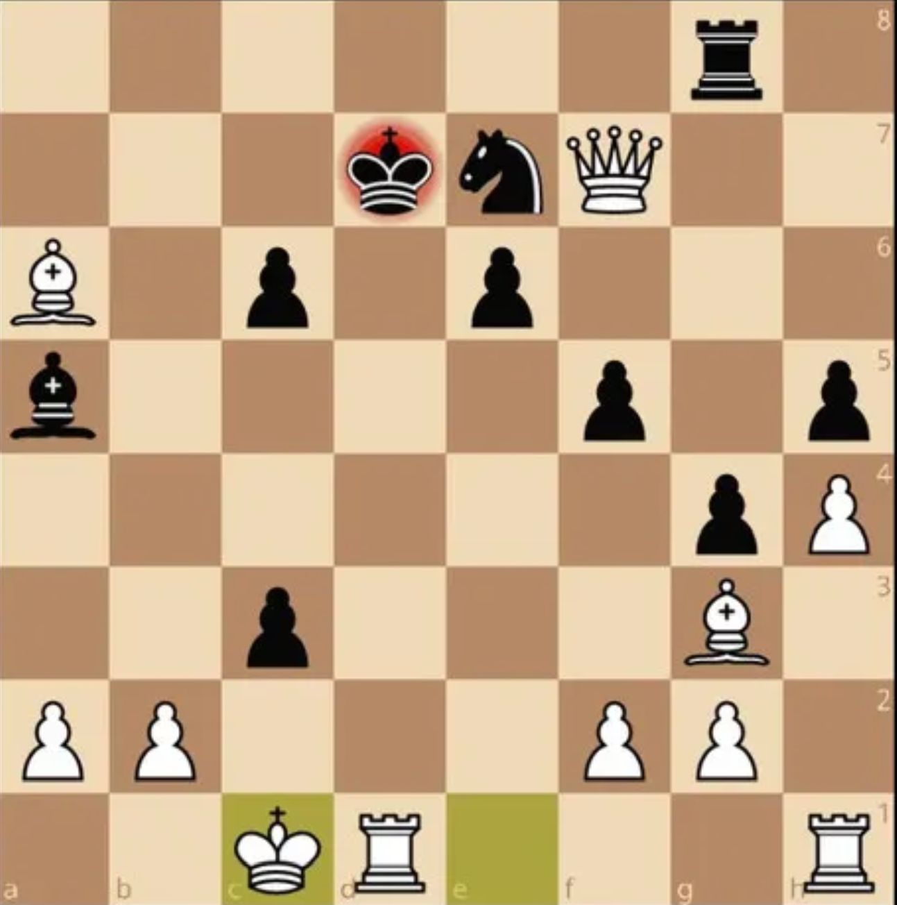

# ChessGPT

A GPT trained from scratch to play chess, directly from character-level PGN transcripts —
no chess engine features, no legal-move constraints baked into training, just next-token
prediction over games shaped like:

```
;1.e4 e5 2.Nf3 Nc6 3.Bb5 a6 4.Ba4 Nf6 5.O-O Be7 ...
```

Every game starts with `;` (the delimiter token) and the model is trained purely to predict
the next character. At inference time `engine.py` turns that into legal play: it enumerates
every legal move with `python-chess`, scores each one as a candidate continuation under the
model, and plays the highest-probability move. This means the model can never output an
illegal move, regardless of how it was trained.

# Attribution

This repository is a derivative work, not an original project. It started as a clone of
[adamkarvonen/train_ChessGPT](https://github.com/adamkarvonen/train_ChessGPT), which is
itself built on [Andrej Karpathy's nanoGPT](https://github.com/karpathy/nanoGPT). The full
original commit history is preserved here, so the "Contributors" list on this repo reflects
real authorship of the base code. My own additions on top are the play/GUI interfaces
(`play.py`, `gui.py`, `engine.py`), the packed-attention scoring support in `model.py`, the
Hugging Face Hub integration in `train.py`, and the `hf_space/` deployment setup — see the
git log for the exact diff. Licensed MIT, same as upstream (see `LICENSE`).

## install

```
pip install torch numpy transformers datasets tiktoken wandb tqdm chess flask waitress
```

`chess` (python-chess) is required by `engine.py`/`play.py`/`gui.py`. `flask` and `waitress`
are only needed for `gui.py`.

## play against it

A checkpoint trained on this repo already lives at `out-chess-16layer/ckpt.pt` once you've
trained or downloaded one (see below). Two ways to play:

**Terminal** (`play.py`) — text-based, moves in SAN:

```
python play.py --out_dir=out-chess-16layer                  # model plays black
python play.py --out_dir=out-chess-16layer --human_color=b  # model plays white
python play.py --hf_repo_id=fritz007x/chess-gpt-16layer-ckpt # pull ckpt.pt from HF Hub first
```

Enter moves like `e4`, `Nf3`, `O-O`, `exd5`, `Qxe7+`; type `quit` to stop.
`--move_temperature` is 0 by default, which always plays the model's top-scored move (its
strongest setting); raise it to sample over whole moves instead of individual characters —
every sampled option is still guaranteed legal.

**Browser GUI** (`gui.py`) — click-to-move board, served locally:

```
python gui.py --out_dir=out-chess-16layer
```

then open `http://127.0.0.1:8686`. Each visitor gets an isolated session (cookie-keyed), so
it's safe to point friends at one running instance. Useful flags: `--device=cuda` for GPU
inference, `--host=0.0.0.0` to accept connections from other machines, `--port`.



## how move scoring works (`engine.py`)

A candidate move is scored as the continuation `san + " "` after the running game string —
the trailing space matters, since it forces the model to commit to ending the move there
rather than leaking probability onto longer moves (`"Nf3"` vs `"Nf3+"`). Two scorers exist
and are cross-checked in `test_engine.py`:

- **naive** — one padded row per candidate move, each a full copy of the game-so-far prefix.
  Simple enough to trust as a test oracle, but cost scales with the number of legal moves
  (~4s/move in the middlegame on CPU).
- **packed** (default) — the prefix is laid down once, and every candidate suffix is packed
  after it into a single sequence, with an attention mask that lets each suffix see the
  prefix and itself but not other candidates, and position ids that restart each suffix
  right after the prefix. This needs one forward pass over roughly
  `prefix + 5 chars × num_candidates` tokens instead of one pass per candidate. Enabling this
  required adding explicit `attn_mask`/`pos` arguments through `model.py`'s attention layers.

Checkmate needs special handling: python-chess writes it as `"Qxf7#"`, but the training
transcripts spell it `"Qxf7+"`, so both spellings are scored and their probabilities summed
— scoring only the `"#"` form made every mate look ~10 nats unlikely and the engine would
refuse to deliver checkmate.

## training data

Datasets are Hugging Face collections of length-1024 character blocks, each beginning with
`;` — e.g. `";1.e4 e5 2.Nf3 ..."`. `get_batch()` in `train.py` is modified from stock nanoGPT
to ensure every training example starts at the beginning of a block rather than a random
offset, so the model always sees `;1.` at the start of its context.

```
python data/lichess_hf_dataset/prepare.py
```

Edit `file_path` inside that script to point at the dataset of your choice from
https://huggingface.co/datasets/adamkarvonen/chess_games/tree/main. After preparing data,
`data/lichess_hf_dataset/get_batch.ipynb` lets you sanity-check that every batch begins with
`;1.` (token ids `[15, 6, 4]`).

## training

```
python train.py config/train_chess_16layer.py
```

`config/train_chess_16layer.py` is the checked-in config used to train the released
16-layer / 50M-parameter checkpoint (8 heads, 512 embedding dim, block size 1023, bf16,
`torch.compile` on). The 25M-parameter model took 72 hours on one RTX 3090; the 50M model
took 38 hours on four RTX 3090s. Lower `batch_size` and raise gradient accumulation to train
on less than 8GB of VRAM. Wandb loss curves and configs:
https://api.wandb.ai/links/adam-karvonen/u783xspb

Set `hf_repo_id` in a config (or on the command line) to push `ckpt.pt` to a Hugging Face
Hub model repo after every checkpoint save, in the background so upload overlaps with the
next training iterations. Add `resume_from_hf=True` to pull the checkpoint from that repo on
startup instead of training from scratch — useful for resuming a run on a different machine.

## deploying the GUI publicly

`hf_space/` packages `gui.py` as a Docker-based Hugging Face Space (CPU, free tier), pulling
the checkpoint from a public HF model repo at build time rather than bundling it in git. See
`hf_space/DEPLOY.md` for the one-time setup and `hf_space/README.md` for what's in the image.

## troubleshooting

`torch.compile` (on by default) is not available on all platforms, notably Windows. If you
hit related errors, add `--compile=False` — this slows training down but lets it run.

For background on GPT internals and language modeling generally (this repo's model/training
code is otherwise stock nanoGPT), see Karpathy's
[Zero To Hero series](https://karpathy.ai/zero-to-hero.html), particularly the
[GPT video](https://www.youtube.com/watch?v=kCc8FmEb1nY).
